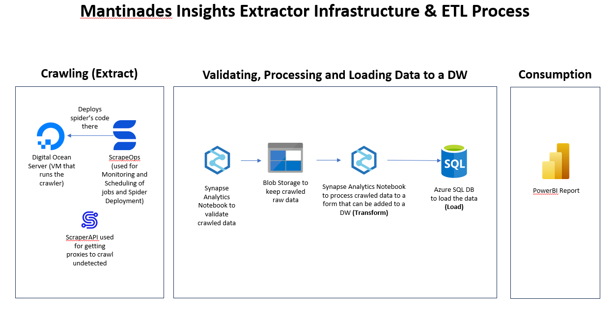
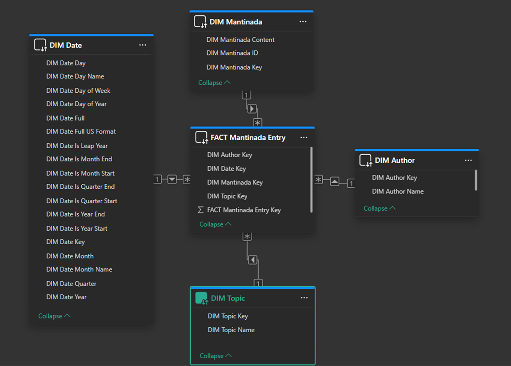
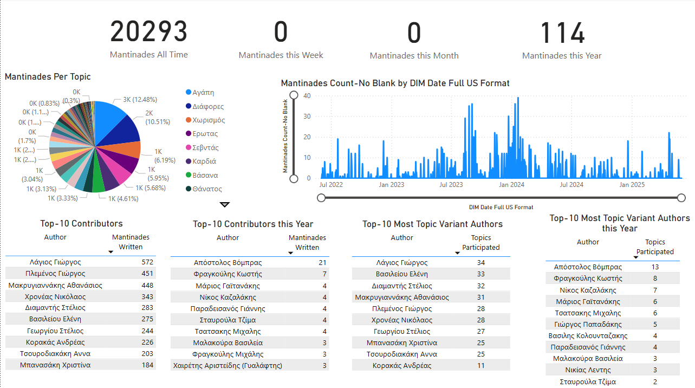

# Mantinades (Rhyming Couplets) Scraper, ETL and Insights

## Introduction

A mantinada is a short, rhymed, and often improvised poetic expression, usually in a couplet of fifteen syllables, that conveys emotions, thoughts, or commentary on life, love, nature, etc. It is deeply connected to Cretan tradition and music but it can also be encountered in other parts of Greece like the Dodecanese islands.

[mantinades.gr](https://www.mantinades.gr) is a site that hosts many of these kinds of poems (around 20 thousand as of May 2025) grouped by topic, and also provides information about when each mantinada was added, who contributed it, and its associated topics.

## Project Scope

The main goal of this project was to perform cloud-based ETL on publicly available mantinades to extract insights regarding overall contribution but also per author and topic. This required the following:

- Scrape mantinades from the source website.
- Process and transform the data using an ETL pipeline.
- Load the cleaned data into a cloud-based Data Warehouse.
- Visualize insights with Power BI.

## Project Outline

A high-level depiction of the project can be seen in the below picture:

The project architecture consists of three main components: Crawling, ETL, and Reporting, as shown above.

In the first part, Crawling (Scraping), I used Scrapy where I made a spider that scrapes all the mantinades and stores the results in an Azure Blob Storage Container as raw data (equivalent to Medallion Architecture's Bronze layer). This initially was straightforward to implement, but deploying it introduced security and infrastructure challenges. Initially, I needed to figure out where and how to deploy my spider in the most cost-effective and maintairnable way. Following [this](https://scrapeops.io/python-scrapy-playbook/scrapy-beginners-guide-deployment-scheduling-monitoring/) tutorial I deployed my spider's code to a [DigitalOcean](https://www.digitalocean.com/) VM and used [ScrapeOps](https://scrapeops.io/) for monitoring and scheduling my spider. However, to avoid detection, I used [ScraperAPI](https://www.scraperapi.com/) to route requests through proxies. Unfortunately, this approach slowed down the crawling process considerably, but it remains a necessary tradeoff unless I switch to a different proxy API in the future. Lastly, to connect this step with the ETL pipeline, the spider writes a JSON status file upon completion. This file indicates whether scraping succeeded or failed, allowing the pipeline to act accordingly. Since scraping is time-consuming, this decouples the two steps and avoids having the ETL process wait.

In the second part, the ETL process loads the data into a cloud-based Data Warehouse. The Warehouse has the following Star Schema:

This means that we have a single Factless Fact Table with a granularity of a row per mantinada and topic. For example, if a mantinada is tagged under two topics, it appears as two rows in the fact table. Each mantinada is associated with a single author, so no duplicates occur across authorship. The ETL pipeline that was implemented in Azure Synapse Analytics works as follows:

1. Validates the JSON status file from the crawling step. If the file is invalid, the pipeline fails, to prevent loading incomplete or corrupt data.
2. Processes the crawled raw data from the `data` container and converts it to Parquet files stored in the `processed_data` container, ready for loading into the Data Warehouse.
3. The existing database is truncated and repopulated with the latest data from the `processed_data` container.
4. Whether the pipeline succeeded or failed we notify via e-mail the user.

The crawling and ETL processes are orchestrated to run weekly, with scraping scheduled three hours before the ETL job to ensure timely data availability.

Finally, I developed a Power BI report that provides insights into:

- The cumulative number of mantinades over time
- Most popular topics
- Top contributors (overall and by year)
- Authors with the most diverse topic contributions

A snapshot of the report is shown below:

## Technologies Used

- Python 
- SQL
- Microsoft Azure
- Azure Synapse Analytics
- Microsoft PowerBI
- Scrapy
- ScrapeOps
- ScraperAPI
- DigitalOcean
- Azure Blob Storage
- Azure SQL Database

## Future Improvements

- Performance enhancements (e.g., faster crawling with alternate proxying methods)
- Support for incremental data loading
- Improved auditing and monitoring
- Additional data quality checks
- NLP-based insights (e.g., keyword extraction, rhyme analysis)
- Data enrichment (e.g., storing separately the 2 parts of mantinada, tagging sentiment or genre)
- Instruction to replicate project locally(using Docker) and in the Cloud
